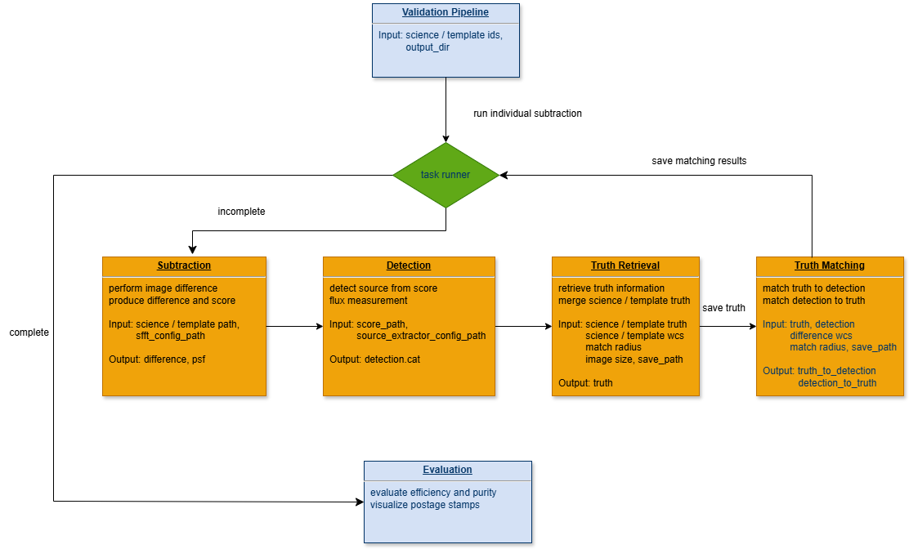

# sidecar overview

The supernova detection pipeline for the Roman Supernova Project Infrastructure Team (SNPIT). This package is designed to performance image differnece, detect transient sources, and evaluate efficiency and purity of Roman images.

This package is intended to be run within the roman-snpit-env container environment. The instructions below walk you through preparing your environment and running the pipeline step-by-step on Perlmutter at NERSC. 

## Step 1: Setup Container Environment

This package is compatible with the Roman Supernova PIT environment used to run `phrosty`:

https://github.com/Roman-Supernova-PIT/phrosty/tree/main/examples/perlmutter

Before using `sidecar`, first follow the `phrosty` Perlmutter setup instructions and ensure that you can run `phrosty` interactively. You can stop following `phrosty` instructions at the "Running with the Nsight Profiler" section.

Once `phrosty` is working, return to the same directory where you setup the `phrosty` environment and proceed with Step 2. 

## Step 2: Clone `sidecar`

Run the following in terminal:

```bash
git clone https://github.com/Roman-Supernova-PIT/sidecar.git
```

Once cloning is complete, navigate to the 'sidecar' directory.

## Step 3: Detection

To run the detection pipeline, run the following code in `sidecar` repo of the terminal.

```
python sidecar/pipeline.py -d [path of the input file] -o [output directory]
```

E.g.,

```
python sidecar/pipeline.py -d test/test_one_data_record.csv -o /dia_out_dir
```

Note the `/dia_out_dir` only makes sense because we're running in the podman container, where we have bound /dia_out_dir to an output directory.

Can run by specifying the values on the command line
```
python sidecar/pipeline.py --pointing 53526 --sca 1 --band R062 --template-pointing 5044 --template-sca 8 --template-band R062 -o /dia_out_dir
```

Can also run by just specifying the pointing, sca, band of the science image

```
python sidecar/pipeline.py --pointing 53526 --sca 1 --band R062 -o /dia_out_dir
```

or just by passing the image path

```
image_path=/dvs_ro/cfs/cdirs/lsst/shared/external/roman-desc-sims/Roman_data/RomanTDS/images/simple_model/R062/53526/Roman_TDS_simple_model_R062_53526_1.fits.gz
python sidecar/pipeline.py --science-path ${image_path} -o /dia_out_dir
```

## sidecar Workflow


- Input: The pipeline takes a `csv` file with 6 required columns. They will be used as data ids to identify science and template images. During running, the pipeline will loop over each row to perform image difference, source detection, truth retrieval, and truth matching.
  ```
  | science_band | science_pointing | science_sca | template_band | template_pointing | template_sca |
  ```
- Subtraction: Perform image difference using [SFFT](https://github.com/thomasvrussell/sfft) algorithm.
- Detection: Perform source detection using [Source-Extractor](https://sextractor.readthedocs.io/en/latest/Introduction.html).
- Truth Retrieval: Retrieve truth tables of the science image and template image.
- Truth Matching: Match the truth information to the detected sources for evaluating efficiency. Match the detected sources to truth for evaluating purity.
- Evaluation: Evaluate efficiency and purity.
