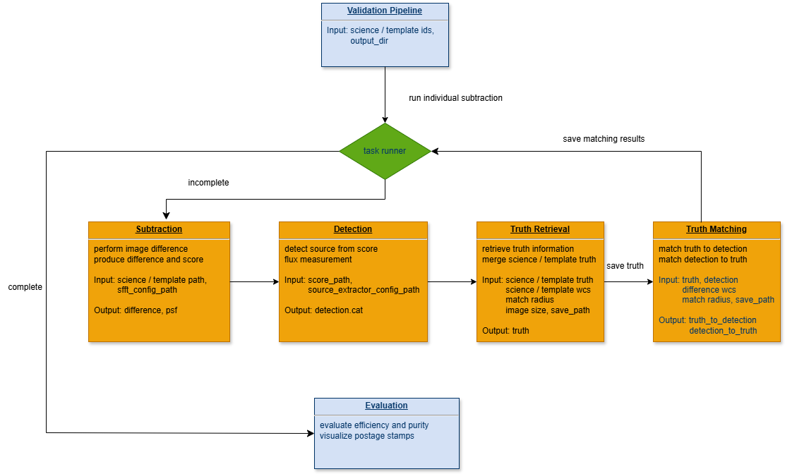

# detect_supernova 

The supernova detection pipeline for the Roman Supernova Project Infrastructure Team (SNPIT). This package is designed to performance image differnece, detect transient sources, and evaluate efficiency and purity of Roman images.

## Setup

This package is compatible with the default environment of Perlmutter on NERSC.

## Workflow 


- Input: The pipeline takes a `csv` file with 6 requred columns. They will be used as data ids to identify science and template images. During running, the pipeline will loop over each row to perform image difference, source detection, truth retrieval, and truth matching.
  ```
  | science_band | science_pointing | science_sca | template_band | template_pointing | template_sca |
  ```
- Subtractoin: Perform image difference using [SFFT](https://github.com/thomasvrussell/sfft) algorithm.
- Detection: Perform source detection using [Source-Extractor](https://sextractor.readthedocs.io/en/latest/Introduction.html).
- Truth Retrieval: Retrieve truth tables of the science image and template image.
- Truth Matching: Match the truth information to the detected sources for evaluating efficiency. Match the detected sources to truth for evaluating purity.
- Evaluation: Evaluate efficiency and purity.

## Detection

To run the detection pipeline, run the following code in `detect_supernova` repo of the terminal.
```
python pipeline/pipeline.py -d [path of the input file] -o [output directory]
```

E.g.,
```
python detect_supernova/pipeline/pipeline.py -d detect_supernova/test/test_one_data_record.csv -o dia_out_dir
```
